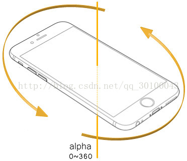
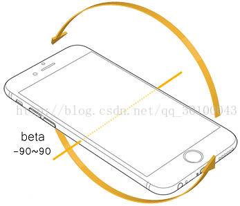
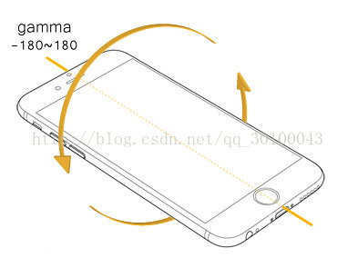
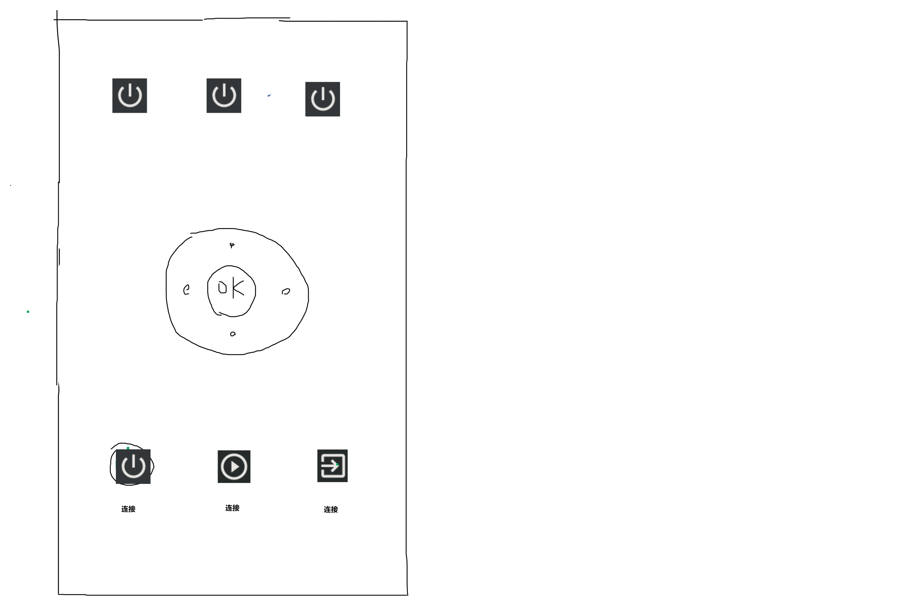

# MagicMouse

网页版的无线飞鼠，使用移动硬件的陀螺仪控制鼠标。

## 控制原理

HTML5 网页能获取到移动设备的陀螺仪信息，可以利用这个信息控制屏幕上的鼠标移动。

## 计划

### 可行性验证

- [x] HTML5 能否获取陀螺仪信息

  - [x] https://blog.csdn.net/qq_30100043/article/details/73323617

    
- [ ] 陀螺仪信息处理
  
  - [ ] 映射方式 1：计算角度和初始的差，直接应用到x/y坐标
  - [ ] 映射方式 2：（未定）
- [x] 后端能否简便使用 WebSocket
  - [x] NodeJS的 WebSocket 原生支持
  - [x] [Go websocket](https://blog.csdn.net/swan_tang/article/details/103530311)
  - [x] GoFrame（选中）
    - [x] GoFrame WebSocket：https://www.bookstack.cn/read/goframe-1.11/net-ghttp-websocket-index.md
    - [x] 解析 JSON：`encoding/json` 包（https://www.cnblogs.com/ycyoes/p/5398796.html）
- [x] 后端能否控制鼠标移动
  - [ ] [RobotJs](https://blog.csdn.net/qq_34995862/article/details/106501587)
  - [x] [RobotGo](https://www.ctolib.com/robotgo.html)
- [ ] 后端能否在屏幕绘图起到提示作用
- [ ] 前端跨平台特性
  
  - [ ] 判断平台对陀螺仪硬件/软件的支持
- [ ] 后端跨平台特性
- [ ] 后端软件封装

### 接口

**API**

1. `/**`：静态网页
2. `/api/v1/ws`：websocket接口

**Websocket 数据帧**

```json
// 开始连接，然后等待服务器返回，才开始发送数据
{
  "cmd": "start",
  // "data": {}
}
// 服务器返回格式
{
    "cmd": "start_done",
    "message": "OK"
}

// 单个角数据帧
{
  "cmd": "data_angle_frame",
  "data": {
    "alpha": 120.8, // 0 ~ 360
    "beta": 10.64,  // -19 ~ 90
    "gamma": 100,   // -180 ~ 180
  }
}

// 信息提示
{
    "cmd": "message",
    "data": {
        "message": "遇到异常！"
    }
}

// 按键
{
    "cmd": "key",
    "data": {
        "key": 27,		// 按照键盘键码，这里是Esc
        "keys": [
            
        ]
    }
}

// 停止指令
{
    "cmd": "stop_from_client"
}
{
    "cmd": "stop_from_server"
}
```

### 文件结构

- `magic_mouse.go`：主程序
- `/frontend/**`：前端的静态文件

### 逻辑设计

1. 处理映射
   1. 按照三角函数映射
   2. 自定义屏幕映射区域
2. 控制
   1. 当控制鼠标移出映射区域的时候，暂时取消对鼠标的控制
   2. 当点击停止的时候，和服务端断开连接
3. 显示
   1. 前端/服务端显示/提示当前控制状态
4. 网络支持
   1. 本地网络支持
      1. 在本地服务端建立连接
      2. 让前端连接本地创建的网络服务
   2. 远程网络服务
      1. 本地服务端连接远端服务器
      2. 前端也连接远端服务器
      3. 通过服务器进行通讯

### 前端设计

**需要可操作的功能**

1. 调试
   1. 显示传感器信息
   2. 显示传感器数据
   3. 显示连接情况
   4. 修改连接URL
2. 操作
   1. 操作按钮
      1. 控制开始/停止
      2. 复位按键，重新设置定位偏移
   2. 控制按钮
      1. 在陀螺仪尚不可用时，使用方向键控制鼠标（*计划*）
      2. 鼠标点击按钮（短按右键，长按左键）
      3. 绑定的按键
         1. `F5`：开始幻灯片放映
         2. `Esc`：退出幻灯片/退出到播放模式
         3. `Ctrl+P`：打开/关闭幻灯片书写
         4. `Ctrl+L`：打开/关闭激光笔模式
         5. `Ctrl+M`：打开/关闭墨迹
         6. `Ctrl+S`：切换到某幻灯片
         7. `W/B`：白/黑屏
         8. `Win+D`：回到桌面
         9. 方向键
         10. 空格
         11. 回车
3. 自定义
   1. 修改对应按键码
   2. 修改按键位置/设置按键排布模板

#### UI设计

**前端**

*大概长这样*



**服务端**

普通的单页